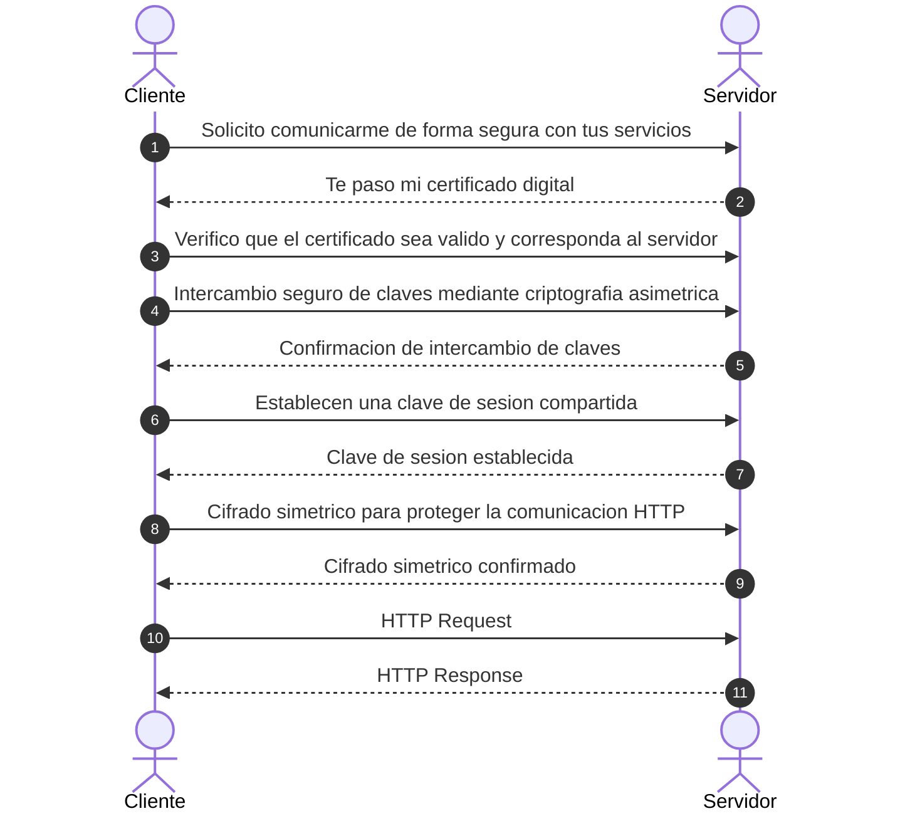

# TLS Handshake

El **TLS Handshake** es el proceso previo de comunicación entre Cliente-Servidor antes de realizar la primera interacción HTTP, donde se ponen de acuerdo en cómo va a ser la seguridad y cifrado en la cual se va a establecer la comunicación entre ambos.

---

## Flujo de Comunicación

---

## Detalle de los Pasos del Proceso

1. **Solicitud de inicio de comunicación:**
   * **Cliente → Servidor:** *Solicito comunicarme de forma segura con tus servicios*

2. **Envío del certificado digital:**
   * **Servidor → Cliente:** *Te paso mi certificado digital*

3. **Validación del certificado:**
   * **Cliente:** *Verifico que el certificado sea válido y corresponda al servidor al que quiero conectarme. Si la validación es correcta, puedo continuar con el Handshake; si no es válido, se interrumpe la conexión.*

4. **Intercambio seguro de claves:**
   * **Cliente ↔ Servidor:** *Una vez validado el certificado, cliente y servidor utilizan mecanismos de criptografía asimétrica para realizar de forma segura el intercambio de claves necesarias para la comunicación.*

5. **Establecimiento de clave de sesión:**
   * **Cliente ↔ Servidor:** *Establecen una clave de sesión compartida para proteger la comunicación.*

6. **Protección de la comunicación HTTP:**
   * **Cliente ↔ Servidor:** *Utilizan la clave de sesión mediante cifrado simétrico para proteger la comunicación HTTP.*

7. **Tráfico de datos seguro:**
   * **Cliente → Servidor:** `HTTP Request` *(Petición HTTP cifrada)*
   * **Servidor → Cliente:** `HTTP Response` *(Respuesta HTTP cifrada)*