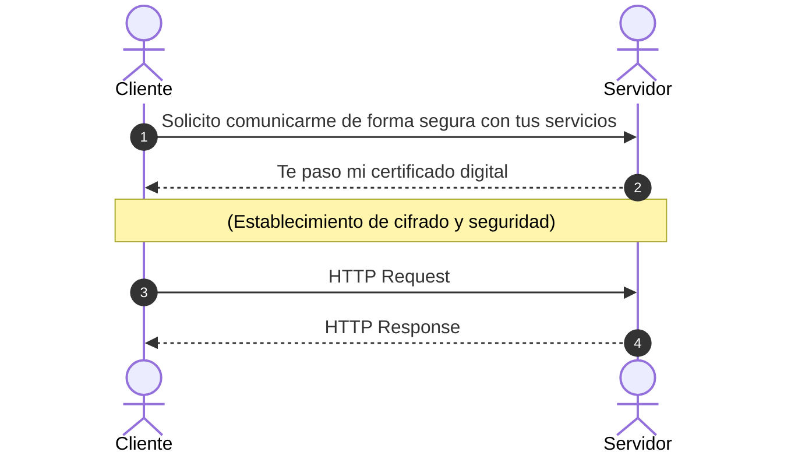

# TLS Handshake

El **TLS Handshake** es el proceso previo de comunicación entre **Cliente** y **Servidor** antes de realizar la primera interacción HTTP, donde se ponen de acuerdo en cómo va a ser la seguridad y cifrado en la cual se va a establecer la comunicación entre ambos.

---

## Flujo de Comunicación

---

## Detalle de Pasos

1. **ClientHello / Solicitud Inicial:**
   * **Cliente → Servidor:** *Solicito comunicarme de forma segura con tus servicios*

2. **ServerHello y Certificado:**
   * **Servidor → Cliente:** *Te paso mi certificado digital*

3. **Intercambio HTTP Seguro:**
   * **Cliente → Servidor:** `HTTP Request`
   * **Servidor → Cliente:** `HTTP Response`